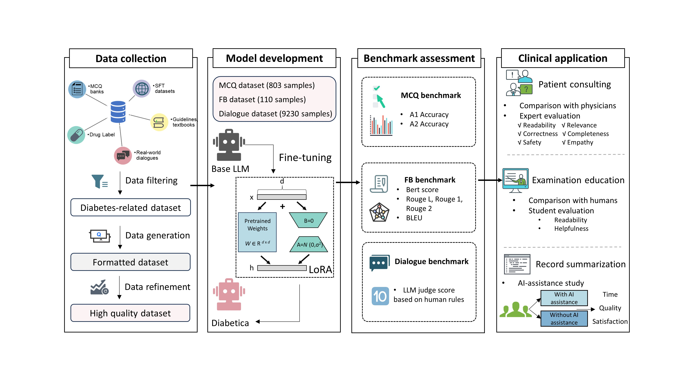
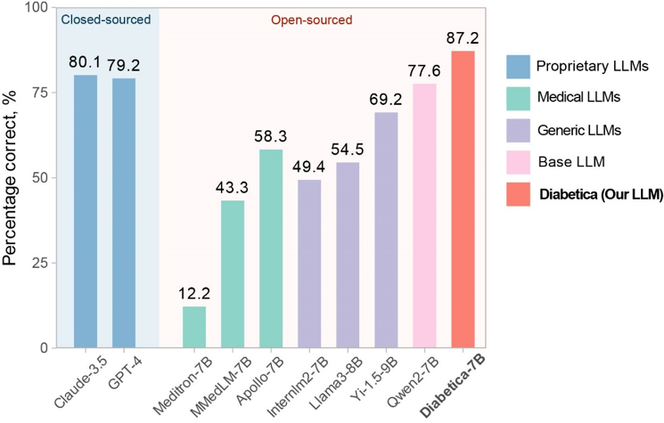
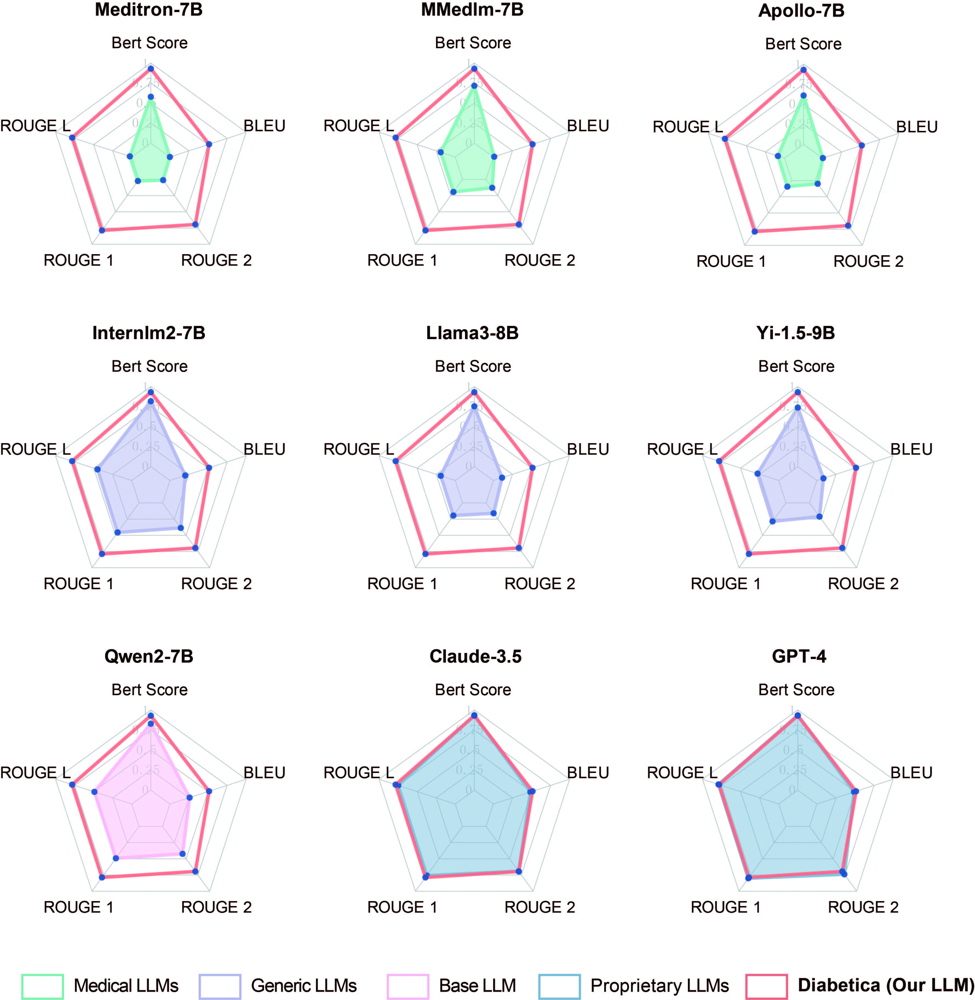
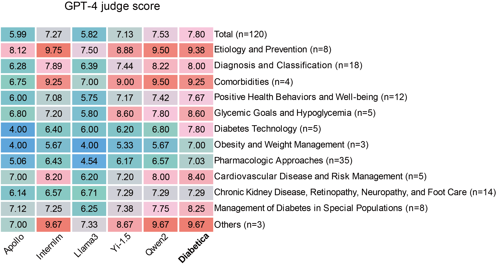

# Diabetica
<div align="center">
<h2>
    An adapted large language model facilitates multiple medical tasks in diabetes care
</h2>


</div>

<p align="center">
⬇️ <a href="https://huggingface.co/WaltonFuture/Diabetica-7B" target="_blank">7B Model</a> ｜⬇️ <a href="https://huggingface.co/WaltonFuture/Diabetica-1.5B" target="_blank">1.5B Model</a> ｜📃 <a href="https://arxiv.org/pdf/2409.13191" target="_blank">Paper</a> <br>
</p>


## Introduction

Hello! Welcome to the repository for [Diabetica](https://arxiv.org/pdf/2409.13191). 

Our study introduced a reproducible framework for developing a specialized LLM capable of handling various diabetes tasks. We present three key contributions: 

- High-performance domain-specific model: Compared with previous generic LLMs, our model Diabetica, showed superior performance across a broad range of diabetes-related tasks, including diagnosis, treatment recommendations, medication management, lifestyle advice, patient education, and so on.

- Reproducible framework: We offered a detailed method for creating specialized medical LLMs using open-source models, curated disease-specific datasets, and fine-tuning techniques. This approach can be adapted to other medical fields, potentially accelerating AI-assisted care development.

- Comprehensive evaluation: We designed comprehensive benchmarks and conducted clinical trials to validate the model's effectiveness in clinical applications. This ensured our model's practical utility and sets a new standard for evaluating AI tools in diabetes care.

Note that we're still actively organizing our code. Please stay tuned for updates coming soon!

<div align=center>

</div>


## Performance

Compared with popular open-source models and closed-source models (including GPT-4 and Claude-3.5), Diabetica showed impressive performance on diabetes benchmarks. Here, we present some of the results.

- **Multiple-choice questions**: Diabetica-7B has an 87.2% accuracy level, significantly surpassing all the other models, including GPT-4 and Claude-3.5.

<div align=center>

</div>

- **Fill-in-the-blank questions**: The performance of Diabetica-7B is superior to all other open-sourced models with similar sizes across all metrics. It is also comparable with state-of-the-art close-source models, such as GPT-4 and Claude-3.5.

<div align=center>

</div>

- **Open-ended dialogues**: Diabetica-7B outperforms other similarly sized open-sourced LLMs by using fine-tuning through a self-distillation pipeline, without the need for RLHF.

<div align=center>

</div>


## Model

### Model Access

Our models are now available on Huggingface.

| Model          | Backbone           | Checkpoint    |
| -------------- | ------------------ | ------------- |
| Diabetica-7B  | Qwen2-7B-Instruct  | [HF Link](https://huggingface.co/WaltonFuture/Diabetica-7B) |
| Diabetica-1.5B  | Qwen2-1.5B-Instruct  | [HF Link](https://huggingface.co/WaltonFuture/Diabetica-1.5B) |

### Setup

```bash
pip install -r requirements.txt
```

### Model Inference

```bash
from transformers import AutoModelForCausalLM, AutoTokenizer
import torch

device = "cuda" # the device to load the model onto
model_path = 'WaltonFuture/Diabetica-7B'

model = AutoModelForCausalLM.from_pretrained(
    model_path,
    torch_dtype="auto",
    device_map="auto"
)
tokenizer = AutoTokenizer.from_pretrained(model_path)

def model_output(content):
    messages = [
        {"role": "system", "content": "You are a helpful assistant."},
        {"role": "user", "content": content}
    ]
    text = tokenizer.apply_chat_template(
        messages,
        tokenize=False,
        add_generation_prompt=True
    )
    model_inputs = tokenizer([text], return_tensors="pt").to(device)
    generated_ids = model.generate(
        model_inputs.input_ids,
        max_new_tokens=2048,
        do_sample=True,
    )
    generated_ids = [
        output_ids[len(input_ids):] for input_ids, output_ids in zip(model_inputs.input_ids, generated_ids)
    ]
    response = tokenizer.batch_decode(generated_ids, skip_special_tokens=True)[0]
    return response

prompt = "Hello! Please tell me something about diabetes."

response = model_output(prompt)
print(response)
```

### Inference with Web Demo

```bash
python web_demo.py
```
### Demo

<video controls>
  <source src="assets/demo.mp4" type="video/mp4">
</video>

## Data

Please contact waltonfuture@sjtu.edu.cn or zying16@fudan.edu.cn if you need our training data.

## Evaluation

### Multiple Choice Questions

Evaluation script for the MCQ benchmark.

```bash
bash scripts/MCQ.sh
```

### Fill-in-the-Blank Questions

Evaluation script for the Fill-in-the-Blank benchmark.

```bash
bash scripts/Fill-in-the-Blank.sh
```


### Open-Ended Dialogues

Evaluation script for the Open-ended Dialog benchmark.

```bash
bash scripts/Dialog.sh
```

## Acknowledgment

The Diabetica family is built upon the amazing [Qwen2](https://huggingface.co/collections/Qwen/qwen2-6659360b33528ced941e557f) family.

This repository is built upon [HuatuoGPT-II](https://github.com/FreedomIntelligence/HuatuoGPT-II).


## Citation
```
@misc{wei2024adaptedlargelanguagemodel,
      title={An adapted large language model facilitates multiple medical tasks in diabetes care}, 
      author={Lai Wei and Zhen Ying and Muyang He and Yutong Chen and Qian Yang and Yanzhe Hong and Jiaping Lu and Xiaoying Li and Weiran Huang and Ying Chen},
      year={2024},
      eprint={2409.13191},
      archivePrefix={arXiv},
      primaryClass={cs.CL},
      url={https://arxiv.org/abs/2409.13191}, 
}
```

